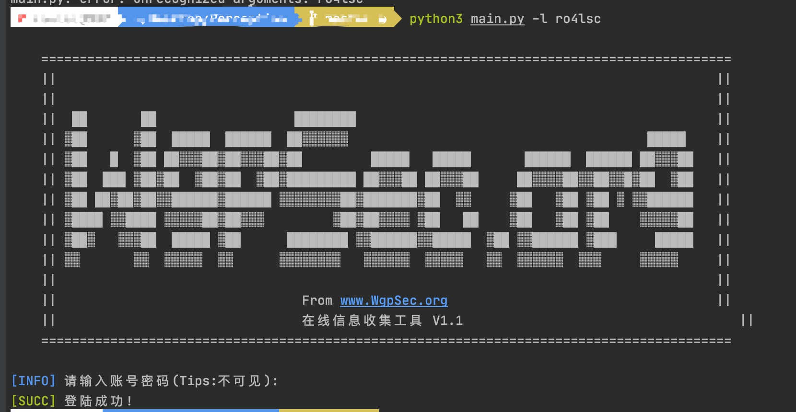
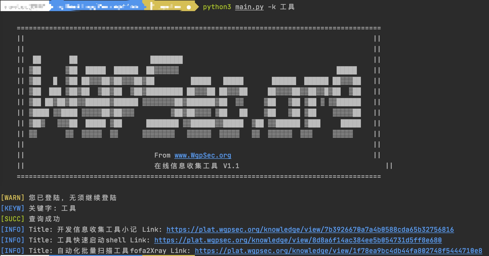
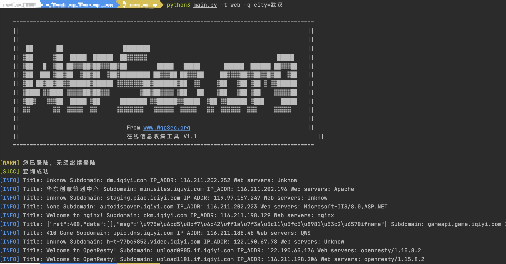
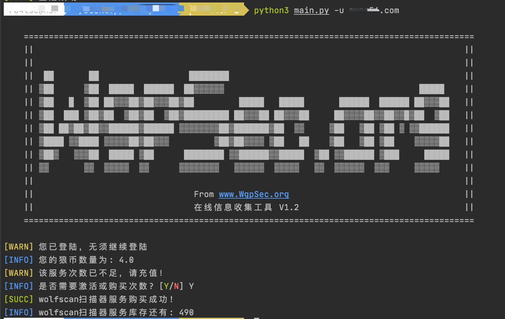
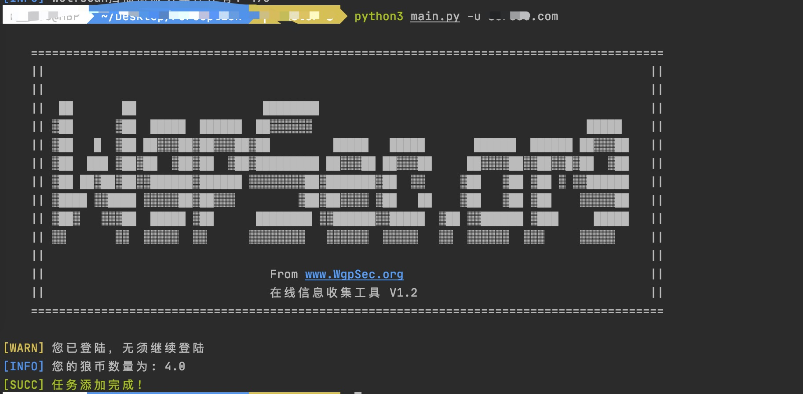

<h1 align="center">Perception 🚀</h1>

<p>
  
  
  <a href="https://plat.wgpsec.org">
    
  </a>
</p>

> 基于狼组安全服务(社区)平台API打造的一款在线信息收集程序

## 🚀 开始使用
Need python3.x
1. 全新Python3环境下需要安装requests: `pip3 install requests`
2. 运行程序
```
python3 main.py -h 
```

如果没有任何报错，则会输出以下信息
```
usage: main.py [-h] [-l LOGIN] [-t TYPE] [-u URL] [-q QUERY] [-k KEYWORD] [-e EXPORT]

嗨！你好！ 当你看到这里的时候，很高兴你已经成为了我们的一员！

optional arguments:
  -h, --help            show this help message and exit
  -l LOGIN, --login LOGIN
                        登陆
  -t TYPE, --type TYPE  (web|host)
  -u URL, --url URL     需要添加扫描的域名
  -q QUERY, --query QUERY
                        (port|host|title|ip|city)
  -k KEYWORD, --keyword KEYWORD
                        enable knowledge api
  -e EXPORT, --export EXPORT
                        查询结果保存的文件路径
```

## ✨用法
e.g：`python3 main.py -l xxxxx`

首先需要登陆xxxx为用户名，然后回车，输入密码(不可见)
登陆的时候已经进行验证了，不需要担心是否登陆，会有提示的
> 信息收集模块
- -t 参数支持 web和host
- -q 参数支持 port|host|title|ip|city
- -e 参数导出结果，结果将会保存到 `Output/xxxx.csv `默认为 `Output/test.csv`
- 指定目标端口 例如`port=4444`
`python3 main.py -t web -q port=4444`
- 指定目标城市例如武汉
 `python3 main.py -t web -q  city=武汉`
 
> 知识库模块
- -k参数指定关键字 例如工具
`python3 main.py -k 工具`

>向wolfscan中添加扫描任务,请注意使用根域名，也就是~~www~~
>`python3 main.py -u xxxx.com`
运行截图见下方


## 👍运行截图





## ⚡️特性

- 支持以城市名、主机IP、网站标题、指定端口为搜索条件
- 程序会将搜索结果匹配社区平台内的知识库文章并返回链接
- 可以使用-u参数往wolfscan中添加扫描任务

## 🛠Todo

1. 美化程序的输出信息
2. 支持多参数搜索（类似fofa）
3. 支持调用wolfscan

## 📝更新日志

### 1.2

更新时间：2020-09-06

 - 发布1.2程序

## 💡免责声明

不能使用该工具进行非法活动，下载该工具就表示同意此条款，后续与作者无关
