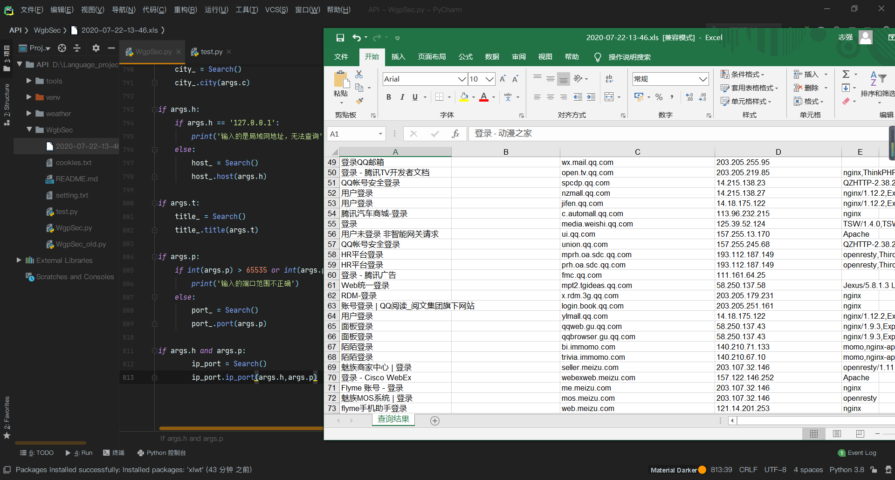

<h1 align="center">Perception 🚀</h1>

<p>
  
  
  <a href="https://plat.wgpsec.org">
    
  </a>
</p>

> 基于狼组安全服务平台API打造的一款在线信息收集程序

## 🚀 开始使用

1. 安装第三方依赖：
    ```bash
    pip install -r requirements.txt -i https://pypi.douban.com/simple
    ```
2. 初始化用户信息：
   
    首次运行程序需要登录你的狼组安全平台账户，程序会提示你输入平台的账号与密码并让你设置查询数量，然后会在当前的目录下生成`user_token.txt`和`pageSize.txt`文件，分别存储用户信息，和用户自定义的查询数量设置。

3. 运行程序：
    
    `python WgpSec.py -h`
    
    如果没有任何报错，则会输出以下信息：
    ```
    usage: WgpSec.py [-h] [--c C] [--h H] [--t T] [--p P]

    嗨！你好！ 当你看到这里的时候，很高兴你已经成为了我们的一员！ 当你第一次运行的时候需要你输入一次你的cookie，方便我们认证，只需要一次哦！

    optional arguments:
      -h, --help  show this help message and exit
      --c C       查询的城市
      --h H       查询的IP
      --t T       查询网站标题
      --p P       查询开放特定端口
    ```

    支持所有参数的查找，并且支持IP和端口联合查询

## ✨示例

e.g：`python WgpSec.py --c 上海`



目前仅支持域名的查找，后续功能会逐渐添加

## ⚡️特性

在未来的开发中，会逐渐完善以下功能：

- ~~查看基本的域名信息~~
- ~~查找对应的指纹和服务~~
- 查找开放的常见端口
- ~~和[知识库](https://plat.wgpsec.org/knowledge)对接，便于查看对应的指纹POC和文献~~
- 自定义输出方式，默认输出是在命令行中，查询完成以后会按照查询时间进行保存，格式为.xls，未来会增加选项，是否输出到命令行。

## 🛠Todo

1. ~~用户可以按照自定义的组合（city、reason、title、ip、ports）进行查询，现有的只能做到某一个参数的查询~~
2. ~~允许批量查询，查询的结果可以自定义导出，导出为xls，目前这个功能没有实现~~
3. ~~验证的实现，由于社区版的`api` 接口需要有社区账号才能做到查询，所以需要另外的一个验证机制，比如直接输入账号密码进行登录，目前实现的方式是让用户直接输入cookie，待优化~~
4. 美化输出和工具的样子


> 这里还有一个返回数据的问题，我们的账号只能做到每次最大为100条数据的返回，在实际的开发过程中我发现：当pageSize为20的时候，他会返回20条数据，但是pageSize为100的时候他只会返回几条数据，这个地方我反复测过，具体问题还不太清楚

## 📝更新日志

### 1.0

更新时间：2020-07-30

 - 发布1.0程序

## 💡免责声明

不能使用该工具进行非法活动，下载该工具就表示同意此条款，后续与作者无关
